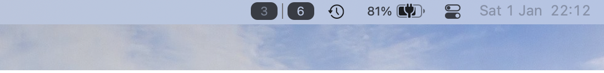

<div align="center">
    
    <h1>Yabai Indicator</h1>
    <p>
        <b>Clickable spaces switcher powered by Yabai</b>
    </p>


<p>Shows a row clickable buttons for all workspaces including fullscreen applications</p>


<p>Alternatively show miniature windows.</p>


<p>Also supports multiple displays (with separate spaces).</p>


<p>Fullscreen applications.</p>


<p>Compact mode.</p>
</div>

## Requirements

[Yabai](https://github.com/koekeishiya/yabai) is required to be running for the space switching and keeping spaces information in sync and showing individual windows. 

In order for this program to work correctly, you will need to disable SIP. Doing this is NOT recommended by Apple, as it will compromise the security of your system. Instructions on doing that can be found on the [yabai wiki](https://github.com/koekeishiya/yabai/wiki).


## Installation

If you don't have yabai, install yabai (version 4.0.0 required) first: [Official installation guide](https://github.com/koekeishiya/yabai/wiki/Installing-yabai-(latest-release))


Just download and unzip the latest release of YabaiIndicator from [Releases](https://github.com/xiamaz/YabaiIndicator/releases) and run. Now you should be able to see empty spaces for each desktop and clicking spaces should work.

In order to allow for showing windows and keeping the spaces in sync, when spaces are removed in mission control the following signals need to be added to your `.yabairc`:

```
yabai -m signal --add event=mission_control_exit action='echo "refresh" | nc -U /tmp/yabai-indicator.socket'
yabai -m signal --add event=display_added action='echo "refresh" | nc -U /tmp/yabai-indicator.socket'
yabai -m signal --add event=display_removed action='echo "refresh" | nc -U /tmp/yabai-indicator.socket'
yabai -m signal --add event=window_created action='echo "refresh windows" | nc -U /tmp/yabai-indicator.socket'
yabai -m signal --add event=window_destroyed action='echo "refresh windows" | nc -U /tmp/yabai-indicator.socket'
yabai -m signal --add event=window_focused action='echo "refresh windows" | nc -U /tmp/yabai-indicator.socket'
yabai -m signal --add event=window_moved action='echo "refresh windows" | nc -U /tmp/yabai-indicator.socket'
yabai -m signal --add event=window_resized action='echo "refresh windows" | nc -U /tmp/yabai-indicator.socket'
yabai -m signal --add event=window_minimized action='echo "refresh windows" | nc -U /tmp/yabai-indicator.socket'
yabai -m signal --add event=window_deminimized action='echo "refresh windows" | nc -U /tmp/yabai-indicator.socket'
```

## How it works

Information on spaces and displays is directly taken from SkyLight API and space and display switches are handled through the NotificationCenter. Unfortunately that is not enough to ensure that the information on the space indicator is correct, as MissionControl can be used to Add/Delete/Reorder spaces. Fortunately MissionControl invocation can be caught via the Accessibility API, as is done by Yabai.

IPC with easy shell scripting is realized through a UNIX Domain Socket Server, that listens at `/tmp/yabai-indicator.socket`. Currently only a `refresh` message is implemented, which is used to allow yabai signals to modify our UI.

The Menubar Indicator uses SwiftUI and is integrated into the StatusBarItem as a Subview of the default button. While replacing the StatusBarItem view is being deprecated, this approach should be future-proof for now.

If certain keybinds modify the spaces arrangement the following commands needs to be added to keep the indicator in sync:

```
echo "refresh" | nc -U /tmp/yabai-indicator.socket
```

This sends a refresh command to Yabai Indicator via a unix-domain socket.

## Comparison to similar applications

[SpaceId](https://github.com/dshnkao/SpaceId) has some additonal configurability for presentation and also allows showing all active spaces on all displays. Switching between spaces is not implemented. As of 12/2021 it does not utilize Acessibility API for catching MissionControl invocation. It does not have a dependency on Yabai.

[WhichSpace](https://github.com/gechr/WhichSpace) shows the current active Space in a single indicator. Does not allow for showing all spaces or all visible spaces on multiple displays.
