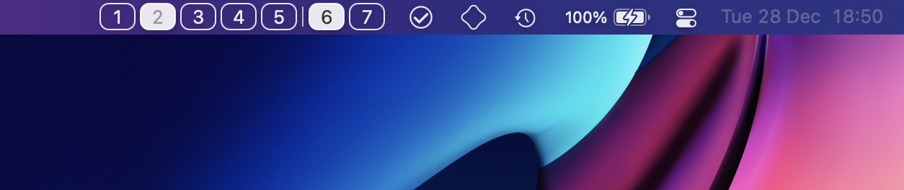
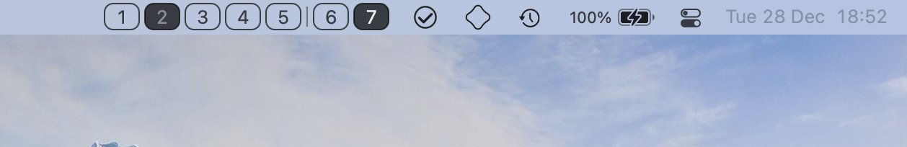

#  Yabai Spaces Indicator

<div align="center">
    
    <h1>Yabai Indicator</h1>
    <p>
        <b>Clickable spaces switcher powered by Yabai</b>
    </p>
    <br>
</div>

## In action





Menubar Applet showing all spaces with clickable buttons for switching spaces.

## Requirements

Yabai is required to be running for the space switching and keeping spaces information in sync. The latter will also require adding the following signals to your `.yabairc`:

```
yabai -m signal --add event=mission_control_exit action='echo "refresh" | nc -U /tmp/yabai-indicator.socket' label=yindmc
yabai -m signal --add event=display_added action='echo "refresh" | nc -U /tmp/yabai-indicator.socket' label=yindda
yabai -m signal --add event=display_removed action='echo "refresh" | nc -U /tmp/yabai-indicator.socket' label=yinddr
```

Currently yabai is expected to reside in `/usr/local/bin/yabai`. Configurability might come at a later point.

## How it works

Information on spaces and displays is directly taken from SkyLight API and space and display switches are handled through the NotificationCenter. Unfortunately that is not enough to ensure that the information on the space indicator is correct, as MissionControl can be used to Add/Delete/Reorder spaces. Fortunately MissionControl invocation can be caught via the Accessibility API, as is done by Yabai.

IPC with easy shell scripting is realized through a UNIX Domain Socket Server, that listens at `/tmp/yabai-indicator.socket`. Currently only a `refresh` message is implemented, which is used to allow yabai signals to modify our UI.

The Menubar Indicator uses SwiftUI and is integrated into the StatusBarItem as a Subview of the default button. While replacing the StatusBarItem view is being deprecated, this approach should be future-proof for now.

## Comparison to similar applications

[SpaceId](https://github.com/dshnkao/SpaceId) has some additonal configurability for presentation and also allows showing all active spaces on all displays. Switching between spaces is not implemented. As of 12/2021 it does not utilize Acessibility API for catching MissionControl invocation. It does not have a dependency on Yabai.

[WhichSpace](https://github.com/gechr/WhichSpace) shows the current active Space in a single indicator. Does not allow for showing all spaces or all visible spaces on multiple displays.
